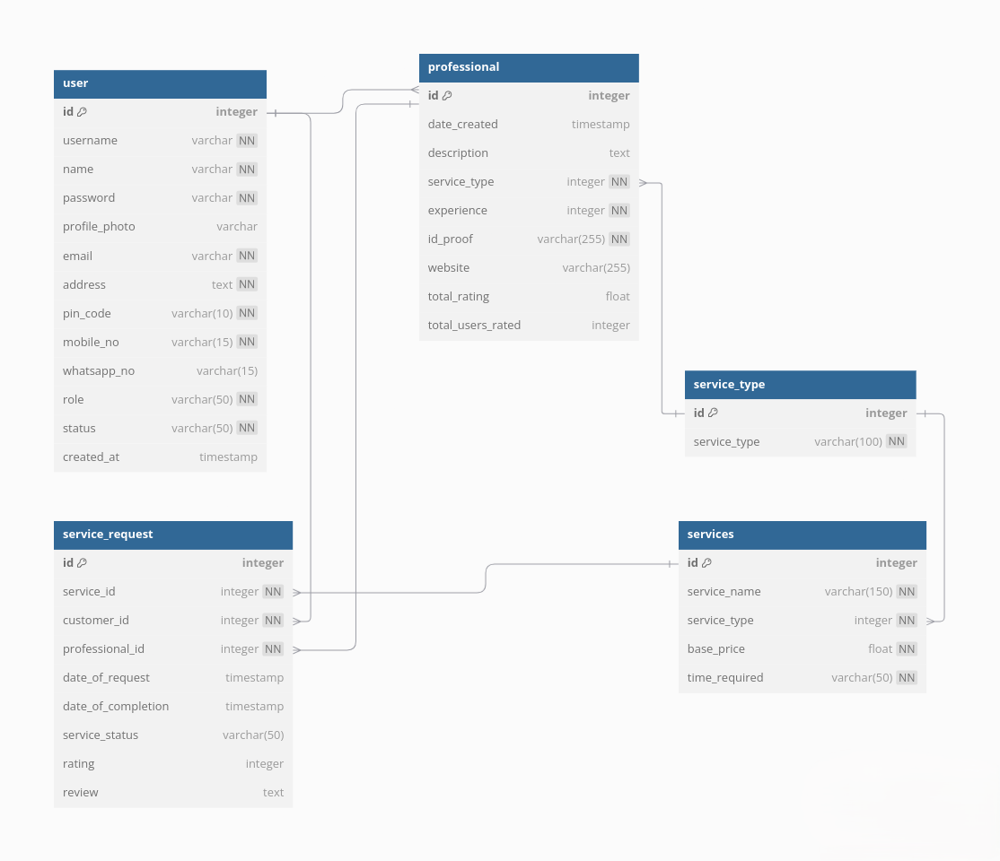

# 🏠 Household Services Application - V2

A multi-role household services platform designed to connect customers with verified service professionals for all home-related servicing needs, managed via an admin dashboard.

## 🚀 Tech Stack

- **Backend**: Flask, SQLite, Redis, Celery
- **Frontend**: Vue.js, Bootstrap (HTML/CSS styling)
- **Templating (if needed)**: Jinja2 (Only for backend logic, not UI)
- **Authentication**: JWT / Flask Security
- **Batch Jobs**: Celery + Redis
- **Database**: SQLite (strictly used as per project rules)

### 🖥️ Development Environment:
- **OS**: Debian 12
---

## 👥 Roles

### 1. Admin (Superuser)
- Manages all users (customers and professionals)
- Approves/rejects service professionals after document verification
- Creates, updates, deletes services
- Blocks/unblocks fraudulent users
- Exports closed service requests as CSV
- Triggers async export jobs (CSV)
- Views and manages all data via Admin Dashboard

### 2. Service Professional
- Registers & logs in
- Can accept/reject assigned service requests
- Views service request history
- Receives reminders for pending visits
- Receives monthly activity reports

### 3. Customer
- Registers & logs in
- Searches for services by name/location/pin code
- Books, edits, and closes service requests
- Posts reviews after completion
- Receives monthly activity reports

---


## 🔧 Features

### ✅ Core Functionalities

- Role-based Authentication (Flask-Security)
- Admin dashboard for user and service management
- Service request booking & lifecycle management
- Search functionality (by service, location, pin code)
- Accept/Reject services (Professionals)
- Daily reminder jobs for pending visits
- Monthly customer activity reports (HTML or PDF)
- CSV export of service request history (Admins)

### 📊 Performance Enhancements

- Redis caching for frequently accessed APIs
- Celery tasks for all async/background processing
- Cache expiry management for performance optimization

---

## 🔁 Batch Jobs (Celery + Redis)

1. **Daily Reminder**  
   - Sends daily alerts to professionals with pending requests (Email/Chat/SMS)

2. **Monthly Reports**  
   - Sends HTML/PDF reports to customers summarizing monthly activity

3. **CSV Export**  
   - Admin-triggered CSV export of service request data (Async + Alert)

---

## 📑 Database Models (ERD Simplified)

- **User**
  (id, username, name, password, profile_photo, email, address, pin_code, mobile_no, whatsapp_no, role [admin/professional/customer], status)

- **Professional**
  (id [FK -> User.id], date_created, description, service_type [FK -> ServiceType.id], experience, id_proof, website, total_rating, total_users_rated)

- **ServiceType**
  (id, service_type)

- **Services**
  (id, service_name, service_type [FK -> ServiceType.id], base_price, time_required)

- **ServiceRequest**
  (id, service_id [FK -> Services.id], customer_id [FK -> User.id], professional_id [FK -> User.id], date_of_request, date_of_completion, service_status [requested/rejected/assigned/closed], rating, review)

---

## 📊 ERD Diagram



## 🖼️ Wireframe

### Overview

The following wireframe illustrates the basic flow and structure of the application. It is designed to guide the user experience and interactions across different roles (Admin, Service Professional, and Customer).

- **Admin Dashboard**: Provides control over users, services, and overall app management.
- **Customer Interface**: Allows customers to book and manage service requests.
- **Service Professional Interface**: Allows service professionals to accept/reject service requests and update their status.

### Wireframe Screenshots


## 📬 API Endpoints (Examples)

- `POST /api/auth/login` — User/Admin login
- `POST /api/auth/register` — Customer/Professional registration
- `GET /api/admin/services` — List all services
- `POST /api/customer/requests` — Create service request
- `POST /api/professional/requests/{id}/accept` — Accept request
- `POST /api/export/csv` — Admin triggers CSV export

---

### 🛠️ Install and Run

1. **Clone the repository** to your local machine:

    ```bash
    git clone <https://github.com/RANJEET1106/Household-Service-Application>
    cd <path to the directory>
    ```


2. **Install dependencies** using the `requirements.txt`:

    ```bash
    pip install -r requirements.txt
    ```


3. **Run the Flask app**:

    ```bash
    flask run
    ```

    By default, this will run the app on `http://localhost:5000`.

4. **Add Webhook URL**  
   In the `task.py` file at line 12, update the Webhook URL. The Webhook is used to send notifications/alerts to a third-party service when certain tasks are completed. Make sure to replace the placeholder URL with your actual Webhook URL:

   ```python
   WEBHOOK_URL = "<Enter Your Webhook URL>"  # Update with your actual Webhook URL
   ```

5. **Run Celery Worker** (in a separate terminal):

    ```bash
    python -m celery -A task worker --loglevel=info
    ```

6. **Run Celery Beat** (for periodic tasks like scheduled jobs):

    ```bash
    python -m celery -A task beat --loglevel=info
    ```
---
### 🛠️ Celery Setup

Celery is **officially supported on Linux and Mac** environments. While it can be run on **Windows**, it requires workarounds due to Windows’ limitations with the `multiprocessing` module. Specifically, the **prefork** pool used by Celery doesn't work natively on Windows, and alternatives like the **"solo"** pool are single-threaded and suitable only for development purposes.

#### 💻 Platform Recommendation:
- **Linux and Mac** are the recommended platforms for running Celery in production for better performance and scalability.
- **Windows**: Celery can run on Windows, but it may require using the **"solo"** pool, which is limited and not ideal for production.

For this project, **Celery was used on a Linux environment** to ensure optimal performance and compatibility 

---
### 🔑 Default Usernames and Passwords
For testing and initial setup, the following default user accounts are available:

- **Admin**  
  - Username: `admin`
  - Password: `Password@123`

- **Professional**  
  - Username: `professional`
  - Password: `Password@123`

- **Customer**  
  - Username: `customer`
  - Password: `Password@123`

---

## 💻 Developed By
**RANJEET DESHMUKH**

- GitHub: [@RANJEET1106](https://github.com/RANJEET1106)
- LinkedIn: [RANJEET DESHMUKH](https://www.linkedin.com/in/ranjeet1106)
---

## ⭐️ Consider Giving It a Star
If you found this project useful, consider giving it a star on GitHub! It helps others discover the project and shows appreciation for the work done. 🌟

[Star the repository here](https://github.com/RANJEET1106/Household-Service-Application)

---


